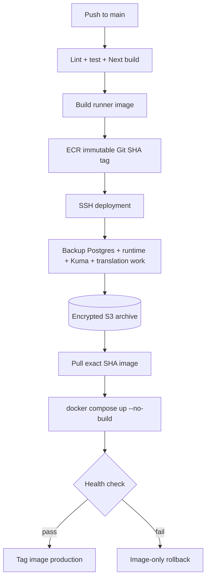

# CI/CD and backup workflow

```mermaid
flowchart TD
  Push[Push to main] --> Verify[Lint + test + Next build]
  Verify --> Image[Build runner image]
  Image --> ECR[ECR immutable Git SHA tag]
  ECR --> Deploy[SSH deployment]
  Deploy --> Backup[Backup Postgres + runtime + Kuma + translation work]
  Backup --> S3[(Encrypted S3 archive)]
  S3 --> Pull[Pull exact SHA image]
  Pull --> Compose[docker compose up --no-build]
  Compose --> Health{Health check}
  Health -->|pass| Promote[Tag image production]
  Health -->|fail| Rollback[Image-only rollback]
```

Verification gates image publication. Backups leave the VPS before migrations start. ECR is used only for application images; S3 holds persistent-data archives.
