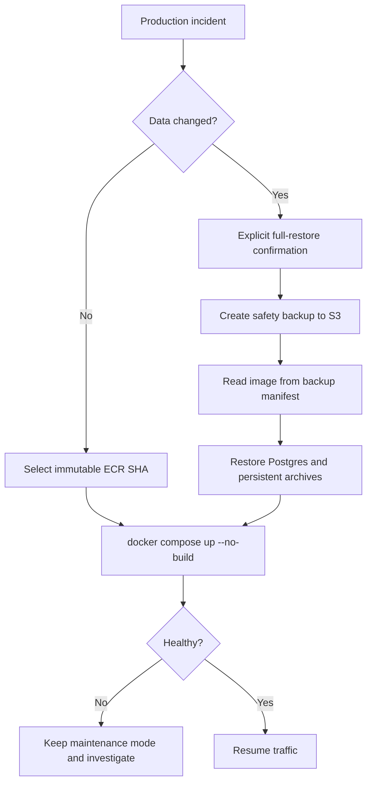

# Rollback workflow

```mermaid
flowchart TD
  Incident[Production incident] --> Choice{Data changed?}
  Choice -->|No| Image[Select immutable ECR SHA]
  Image --> Up[docker compose up --no-build]
  Choice -->|Yes| Confirm[Explicit full-restore confirmation]
  Confirm --> Safety[Create safety backup to S3]
  Safety --> Manifest[Read image from backup manifest]
  Manifest --> Restore[Restore Postgres and persistent archives]
  Restore --> Up
  Up --> Health{Healthy?}
  Health -->|No| Maintain[Keep maintenance mode and investigate]
  Health -->|Yes| Done[Resume traffic]
```

An image-only rollback never mutates persistent data. A full rollback restores the image recorded in the selected backup manifest together with its data.
